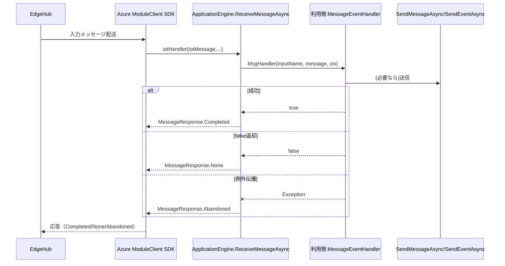

# IoT Hub へのメッセージ送信失敗時のリトライ／エラーハンドリング調査（ソースコードベース）

## 結論

聞いていた仕様は**部分的に正しい**です。

- 共通ライブラリ標準経路（`ApplicationEngine` + `IotHubModuleClient`）では、受信ハンドラ内で例外が発生した場合に `MessageResponse.Abandoned` を返す実装です。
- ただし常に `Abandoned` ではなく、利用側ハンドラが `false` を返した場合は `MessageResponse.None` になります。
- 送信失敗時に「受信失敗扱いで再実行」を成立させるには、利用側実装が送信例外を握り潰さず、`ReceiveMessageAsync` の `catch` まで例外を伝播させる必要があります。
- `SendEventAsync` / `SendEventBatchAsync` レベルの独自リトライ（回数・間隔・指数バックオフ）は実装されていません。

## 受信〜送信ロジックの流れ

1. `AddMessageInputHandlerAsync` が入力ごとの受信ハンドラを登録。
2. `IotHubModuleClient.SetInputMessageHandlerAsync` が Azure SDK `SetInputMessageHandlerAsync` へ橋渡し登録。
3. 受信時に `ApplicationEngine.ReceiveMessageAsync` が起動し、利用側 `MessageEventHandler` を実行。
4. 利用側ハンドラ戻り値 `bool` を `MessageResponse` に変換（`true -> Completed`, `false -> None`）。
5. 利用側処理で例外が上がると `ReceiveMessageAsync` の `catch` で `MessageResponse.Abandoned` を返却。
6. この戻り値が SDK 経由で edgeHub 側へ返る。



## 根拠コード（ファイルパス・行番号・断片）

### 1) 受信エントリポイントと MessageResponse

- `/home/runner/work/GAUDI-Commons/GAUDI-Commons/src/Applications/ApplicationEngine_InterfaceImplements.cs:260-272`
```csharp
await MyModuleClient.SetInputMessageHandlerAsync(inputName, ReceiveMessageAsync, inputName);
```

- `/home/runner/work/GAUDI-Commons/GAUDI-Commons/src/ModuleClient/IotHubModuleClient.cs:137-139`
```csharp
MessageHandler handler = async (msg, obj) => { return await iotHandler(new IotMessage(msg), obj); };
await MyModuleClient.SetInputMessageHandlerAsync(inputName, handler, userContext).ConfigureAwait(false);
```

- `/home/runner/work/GAUDI-Commons/GAUDI-Commons/src/Applications/ApplicationEngine_InternalInterfaceImplements.cs:397-450`
```csharp
MessageResponse retResp = MessageResponse.None;
...
bool result = await eventData.MsgHandler(eventData.InputName, message, eventData.UserContext);
retResp = result.ToMessageResponse();
...
catch (Exception ex)
{
    MyLogger.WriteLog(ILogger.LogLevel.ERROR, $"ReceiveMessageAsync failed. {ex}", true);
    MyLogger.WriteLog(ILogger.LogLevel.ERROR, $"This message will be lost. body:{message.GetBodyString()}", true);
    retResp = MessageResponse.Abandoned;
}
```

- `/home/runner/work/GAUDI-Commons/GAUDI-Commons/src/Applications/ApplicationEngine.cs:51-64`
```csharp
public static MessageResponse ToMessageResponse(this bool thisResult)
{
    MessageResponse retResp = MessageResponse.None;
    switch (thisResult)
    {
        case true:
            retResp = MessageResponse.Completed;
            break;
        case false:
            retResp = MessageResponse.None;
            break;
    }
    return retResp;
}
```

### 2) 送信ラッパーと例外処理

- `/home/runner/work/GAUDI-Commons/GAUDI-Commons/src/Applications/ApplicationEngine_InterfaceImplements.cs:280-324`
```csharp
if ( true == sendFlag )
{
    await MyModuleClient.SendEventAsync(outputName, sendingMsg);
}
else
{
    ... throw new Exception("Message send error.(ModuleClient disconnected)");
}
```

- `/home/runner/work/GAUDI-Commons/GAUDI-Commons/src/ModuleClient/IotHubModuleClient.cs:84-96`
```csharp
if (string.IsNullOrEmpty(message.GetMessageId()))
{
    message.SetMessageId(Util.GetMessageId());
}
await MyModuleClient.SendEventAsync(outputName, message.GetMessage()).ConfigureAwait(false);
```

- `SendEventBatchAsync` は実装なし（リポジトリ検索結果 0 件）。

### 3) 受信失敗扱いへの制御フロー

- 送信失敗例外を利用側が未捕捉で上げれば `ReceiveMessageAsync` 側 `catch` に入り `Abandoned`。
- 利用側が例外を捕捉して `false` を返す実装だと `None`。

## リトライ／エラーハンドリング詳細表

| 対象 | 実装有無 | 内容 | 設定可否 |
|---|---|---|---|
| 受信処理エラー時の応答 | あり | `catch` で `MessageResponse.Abandoned` | 固定 |
| 利用側戻り値変換 | あり | `true -> Completed`, `false -> None` | 固定 |
| 送信 (`SendEventAsync`) の独自リトライ | なし | `try/catch/retry` なし、例外は上位伝播 | なし |
| バッチ送信 (`SendEventBatchAsync`) | なし | 実装自体なし | - |
| 接続確立 (`OpenAsync`) | あり | `Init()` 内で失敗時 1 秒待機で再試行 | 固定（設定なし） |
| Twin 取得 | あり | `Init()` 内で失敗時 1 秒待機（再試行） | 固定（設定なし） |
| `Disconnected_Retrying` 中送信 | あり | 1 秒ポーリングで復帰待ち | 固定（設定なし） |
| Polly / `ITransientErrorDetectionStrategy` | なし | 該当コードなし | - |

## 送信失敗時のログ／デッドレター／退避

- エラーログは出力されます。  
  `/home/runner/work/GAUDI-Commons/GAUDI-Commons/src/Applications/ApplicationEngine_InternalInterfaceImplements.cs:433-435`
- デッドレターキュー、ファイル退避、永続キューは実装されていません（該当コードなし）。
- `Logger` にはメモリ上 `Queue<string>` があるものの、ログ送信用であり永続化や再送戦略はありません。  
  `/home/runner/work/GAUDI-Commons/GAUDI-Commons/src/Logger/Logger.cs:89, 192-223`

## 注意点・前提条件（利用側依存）

- 「送信失敗時に受信〜送信全体を再実行してメッセージ消失を防ぐ」が成立するかは、**利用側ハンドラ実装次第**です。
  - 例外を再throw/未捕捉で伝播させる実装: `Abandoned` 経路に入る。
  - 例外を握り潰して `false` 返却する実装: `None` となり、同じ前提での再処理は期待しにくい。
- 共通ライブラリは `Abandoned` を返す経路を持つが、全ケース強制ではありません。
- edgeHub 側の再配信挙動そのものは本ライブラリコード内で保証していません（SDK/ランタイム依存）。
